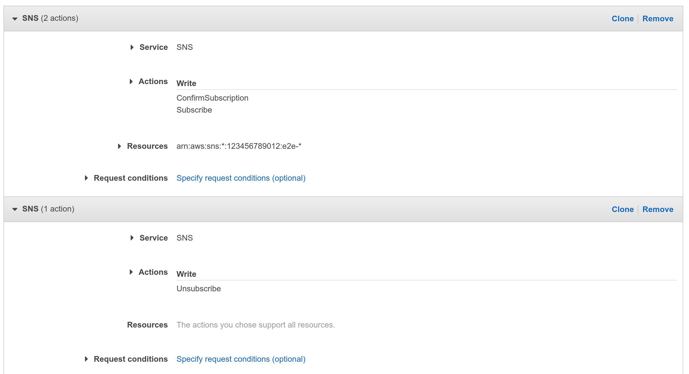
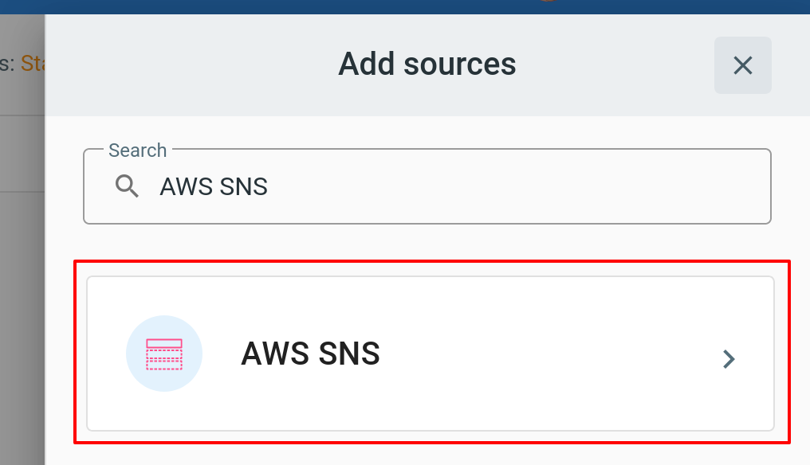
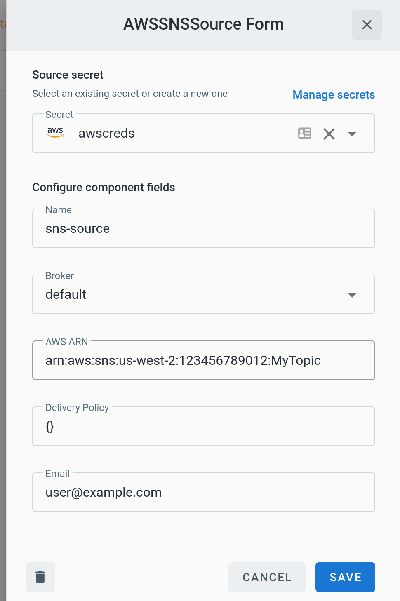

# Event Source for AWS SNS

This event source subscribes to messages from a [AWS SNS topic][sns-docs] and sends them as CloudEvents to an event sink.

## Prerequisites

### SNS Topic (standard)

If you don't already have an AWS SNS standard topic, create one by following the instructions in the [Getting started with Amazon SNS][sns-getting-started] guide.

### Amazon Resource Name (ARN)

A fully qualified ARN is required to uniquely identify the AWS SNS topic.


As shown in the above screenshot, you can obtain the ARN of a SNS topic from the AWS console. It typically has the following format:

```
arn:aws:sns:{awsRegion}:{awsAccountId}:{topicName}
```

Alternatively you can also use the [AWS CLI][aws-cli]. The following command retrieves the ARN of a SNS topic named `MyQueue` in the `us-west-2` region.

```console
$ aws --region us-west-2 sns list-topics
{
    "Topics": [
        ...
        {
            "TopicArn": "arn:aws:sns:us-west-2:123456789012:MyTopic"
        },
        ...
    ]
}
```

### API Credentials

The TriggerMesh AWS SNS event source authenticates calls to the AWS SNS API using an [Access Key][accesskey]. The page at this link contains instructions to create an access key when signed either as the root user or as an IAM user. Take note of the **Access Key ID** and **Secret Access Key**, they will be used to create an instance of the event source.

It is considered a [good practice][iam-bestpractices] to create dedicated users with restricted privileges in order to programmatically access AWS services. Permissions can be added or revoked granularly for a given IAM user by attaching [IAM Policies][iam-policies] to it.

As an example, the following policy contains the permissions required by the TriggerMesh AWS SNS event source to read and delete messages from any topic linked to the AWS account:

```json
{
    "Version": "2012-10-17",
    "Statement": [
        {
            "Sid": "AWSSNSSourceReceiveAdapter",
            "Effect": "Allow",
            "Action": "sns:ConfirmSubscription",
            "Resource": "*"
        },
        {
            "Sid": "AWSSNSSourceReconciler",
            "Effect": "Allow",
            "Action": [
                "sns:ListSubscriptionsByTopic",
                "sns:Subscribe",
                "sns:Unsubscribe"
            ],
            "Resource": "*"
        }
    ]
}
```



## Deploying an Instance of the Source

Open the Bridge creation screen and add a source of type `AWS SNS`.



In the Source creation form, give a name to the event source and add the following information:

* [**Secret**][accesskey]: Reference to a [TriggerMesh secret][tm-secret] containing an Access Key ID and a Secret Access Key to communicate with the AWS SNS API, as described in the previous sections.
* [**AWS ARN**][arn]: ARN of the SNS topic, as described in the previous sections.
* [**DeliveryPolicy**][sns-delivery-policy]: Delivery policy to define how Amazon SNS retries the delivery of messages to HTTP/S endpoints.



After clicking the `Save` button, you will be taken back to the Bridge editor. Proceed to adding the remaining components to the Bridge, then submit it.


A ready status on the main _Bridges_ page indicates that the event source is ready to receive messages from the AWS SNS topic.


## Event Types

The AWS SNS event source emits events of the following type:

* `com.amazon.sns.notification`

[sns-docs]: https://docs.aws.amazon.com/sns/latest/dg/welcome.html
[sns-getting-started]: https://docs.aws.amazon.com/sns/latest/dg/sns-getting-started.html
[aws-cli]: https://aws.amazon.com/cli/
[accesskey]: https://docs.aws.amazon.com/general/latest/gr/aws-sec-cred-types.html#access-keys-and-secret-access-keys
[iam-bestpractices]: https://docs.aws.amazon.com/general/latest/gr/aws-access-keys-best-practices.html#iam-user-access-keys
[iam-policies]: https://docs.aws.amazon.com/IAM/latest/UserGuide/access_policies.html
[arn]: https://docs.aws.amazon.com/service-authorization/latest/reference/list_amazonsns.html#amazonsns-resources-for-iam-policies
[tm-secret]: ../guides/secrets.md
[sns-delivery-policy]: https://docs.aws.amazon.com/sns/latest/dg/sns-message-delivery-retries.html#creating-delivery-policy
