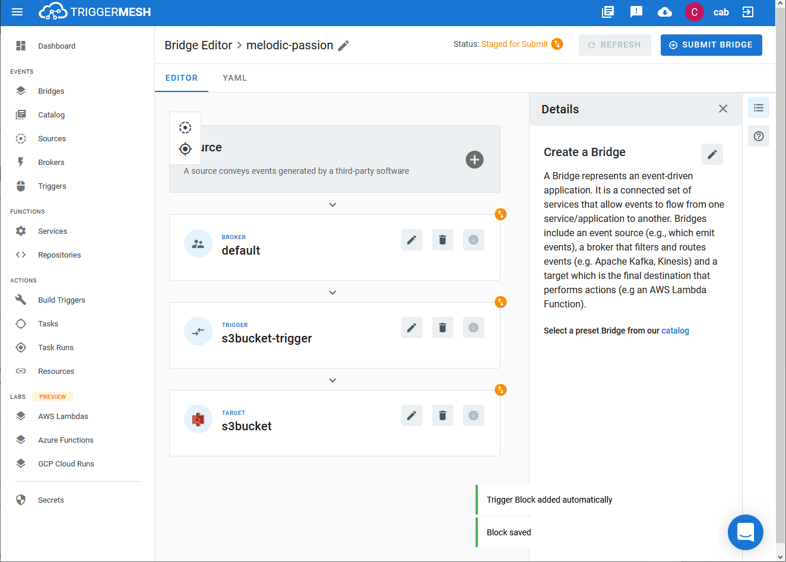

# Event Target for AWS S3

This event Target receives [CloudEvents][ce] over HTTP and invokes an AWS S3 endpoint.

## Prerequisites

1. AWS API key and secret

1. ARN for the S3 bucket to store the event

Consult the [Secrets](../guides/secrets.md) guide for more information about
how to add the AWS API specific secrets.

The ARN for the S3 bucket must include the account number and region of a
pre-defined [access point][aws-s3-ap]

## Deploying an Instance of the Target

Open the Bridge creation screen and add a Target of type `AWS S3`.

In the Target creation form, provide a name for the event Target, and add the following information:

* **AWS Secret**: Reference a [TriggerMesh secret](../guides/secrets.md) containing an AWS API key and Secret as discussed in the prerequisites
* **AWS ARN**: The ARN that points to the AWS S3 topic

There is an optional toggle flag indicating if the full CloudEvent should be sent
to S3 bucket. By default, this is disabled which means the event payload
will be sent only.

After clicking the `Save` button, the console will self-navigate to the Bridge editor. Proceed by adding the remaining components to the Bridge.

After submitting the bridge, and allowing some configuration time, a green check mark on the main _Bridges_ page indicates that the bridge with the AWS S3 Target was successfully created.

For more information about using AWS S3, please refer to the [AWS documentation][docs].

## Event Types

### io.triggermesh.awss3.object.put

Events of this type will store the event payload into an s3 bucket.

This type expects a [JSON][ce-jsonformat] payload with the following properties:

| Name | Value | Description |
|---|---|---|
|**ce-type**|io.triggermesh.awss3.object.put|Event type denoting the s3 put request|
|**ce-subject**|string|The key to use with the assigned bucket for the Target|
|**body**|[JSON][ce-jsonformat]|The data payload to store|

The response [CloudEvent][ce] would have the following payload:

| Name | Value | Description |
|---|---|---|
|**ce-type**|io.triggermesh.targets.aws.s3.result|Denotes a response payload from S3|
|**ce-source**|`arn:aws:s3:...`|The S3 ARN value as configured by the target|
|**body**|[JSON][ce-jsonformat]|A JSON response from the Target invocation|

[ce]: https://cloudevents.io/
[docs]: https://docs.aws.amazon.com/s3/
[aws-s3-ap]: https://docs.aws.amazon.com/AmazonS3/latest/dev/access-points.html
[ce-jsonformat]: https://github.com/cloudevents/spec/blob/v1.0/json-format.md
