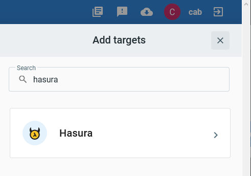
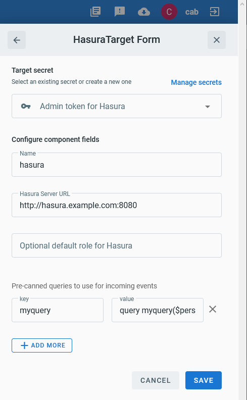

# Event Target for Hasura

This event target receives [CloudEvents][ce] as either a [GraphQL][graphql] query or key/value
pairs for a known query and sends it to [Hasura][hasura].

## Prerequisites

1. Hasura server URL to submit the query against

1. If the server requires authentication, then an [admin secret][hasura-admin] or a [JWT token][hasura-jwt] signed with the server's key

1. If using the JWT token, then an optional user role to invoke the queries as

Consult the [Secrets](../guides/secrets.md) guide for more information about
how to add the admin or user JWT tokens.

## Deploying an Instance of the Target

Open the Bridge creation screen and add a Target of type `Hasura`.

In the Target creation form, provide a name to the event Target, and add the following information:

* **Admin token for Hasura**: Reference to a [TriggerMesh secret][tm-secret] containing an [admin secret][hasura-admin] or user [JWT token][hasural-jwt] to communicate with Haura as described in the prerequisites.
* **Hasura Server URL**: URL endpoint to communicate with Hasura
* **Default Role**: Specify the Hasura user role to use when querying Hasura
* **Pre-canned queries**: A key/value pair of predefined queries available for [CloudEvents][ce] to specify.

After clicking the `Save` button, the console will self-navigate to the Bridge editor. Proceed by adding the remaining components to the Bridge.

After submitting the bridge, and allowing some configuration time, a green check mark on the main _Bridges_ page indicates that the bridge with a Hasura event Target was successfully created.

For more information about using [Hasura][hasura] or [GraphQL][graphql], please refer to the appropriate documentation.

## Event Types

A Hasura event Target accepts the following [CloudEvent][ce] types:

### org.graphql.query.raw

Events of this type are raw [GraphQL][graphql] queries intended to be submitted directly to Hasura.

This type expects a [JSON][ce-jsonformat] payload with the following properties:

| Name  |  Type |  Comment |
| ---|---|---|
| **query**| string| The GraphQL to run against the Hasura server|
| **operationName**| string| The query name specified in the **query** attribute|
| **variables**| map[string]string| Key/value pairs of variables with the key defined in the query|

The response event will have the `ce-type` attribute set to `org.graphql.query.result` and
`ce-source` attribute set to the target's endpoint.

### org.graphql.query

Events of this type leverage the pre-defined query defined when the target is created. In addition
to the `ce-type`, the `ce-subject` must be set to the name of the pre-defined query, otherwise
the event will not be processed by the target.

The [JSON][ce-jsonformat] payload for this type must consist of a string dictionary where the
keys correspond to the variables defined in the query, and key's value is passed as a string.

The response event will have the `ce-type` attribute set to `org.graphql.query.result` and
`ce-source` attribute set to the target's endpoint.

[ce]: https://cloudevents.io/
[ce-jsonformat]: https://github.com/cloudevents/spec/blob/v1.0/json-format.md
[tm-secret]: ../guides/secrets/

[graphql]: https://graphql.org/
[hasura]: https://hasura.io
[hasura-jwt]: https://hasura.io/docs/1.0/graphql/core/auth/authentication/jwt.html
[hasura-admin]: https://hasura.io/blog/hasura-authentication-explained/#admin-secret-auth
