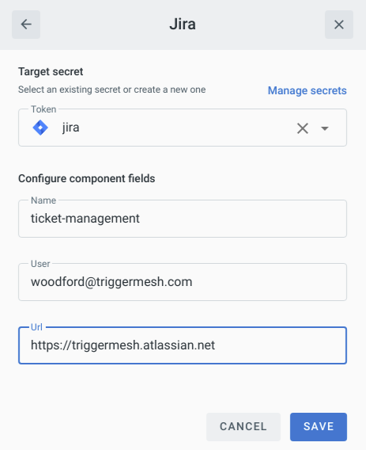

# Event Target for Jira

This event Target receives [CloudEvents][ce] and invokes a Jira endpoint.

## Prerequisites

1. Jira instance or Atlassian cloud tenant.
1. User API token.

To create the user API token at Jira:

- Open the Account settings > Security > [Create and manage API Tokens][api-tokens]
- Press `Create API token` and fill the token name.
- Copy the API token and create a secret for the Jira token at Triggermesh.

Consult the [Secrets](../guides/secrets.md) guide for more information about how to add the secrets.

## Deploying an Instance of the Target

Open the Bridge creation screen and add a Target of type Jira.



In the Target creation form, provide a name for the event Target, and add the following information:

* **User**: the Jira user account that created the token.
* **URL**: base URL for the Jira instance.

Click the `Save` button, the console will self-navigate to the Bridge editor. Proceed by adding the remaining components to the Bridge.

After submitting the bridge, and allowing some configuration time, a green check mark on the main _Bridges_ page indicates that the bridge with was successfully created.


## Event Types

The Jira target accepts these event types:

- `com.jira.issue.create`

The Jira target will create an issue when receiving this event type. The CloudEvent data must contain a Jira issue JSON formated as defined at [this schema](../schemas/jira.issue.json)

Reply contains a a partially filled Jira issue with updated data.

- `com.jira.issue.get`

The Jira target will retrieve an issue when receiving this event type. The CloudEvent data must contain a Jira Issue get request  JSON formated as defined at [this schema](../schemas/jira.issue.get.json)

Reply data contains a Jira issue.

- `com.jira.custom`

The Jira target will request the Jira API when this event type is received. The CloudEvent data expects a generic API request definition as defined at [this schema](../schemas/jira.custom.json).

Please, refer to the [Jira API][jira-api] on how to fill in values for these requests. Reply contains the raw response for the request.

## Examples

Do a custom request to retrieve Jira projects:

* event type: `com.jira.custom`
* data:
```json
{
  "method": "GET",
  "path": "/rest/api/3/project"
}
```

List assignable users to a project `PR1`

* event type: `com.jira.custom`
* data:
```json
{
  "method": "GET",
  "path": "/rest/api/3/user/assignable/search",
  "query": {"project": "PR1"}
}
```

Create an issue

* event type: `com.jira.issue.create`
* data:
```json
{
  "fields": {
    "project":
      {
        "key": "PR1"
      },
      "labels": ["triggermesh","automated"],
      "summary": "Delete this test ticket.",
      "description": "This is a test issue created using Triggermesh Jira Target",
      "issuetype": {
        "name": "Task"
      },
      "assignee": {
        "accountId": "5fe0704c9edf280075f188f0"
      }
   }
}
```

Retrieve an issue:

* event type: `com.jira.issue.get`
* data:
```json
{"id":"IP-9"}
```

[ce]: https://cloudevents.io/
[api-tokens]: https://id.atlassian.com/manage-profile/security/api-tokens
[ce-jsonformat]: https://github.com/cloudevents/spec/blob/v1.0/json-format.md
[jira-api]: https://developer.atlassian.com/cloud/jira/software/rest/intro/
