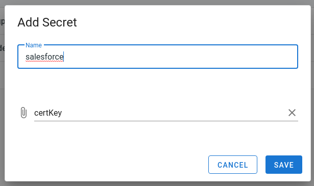
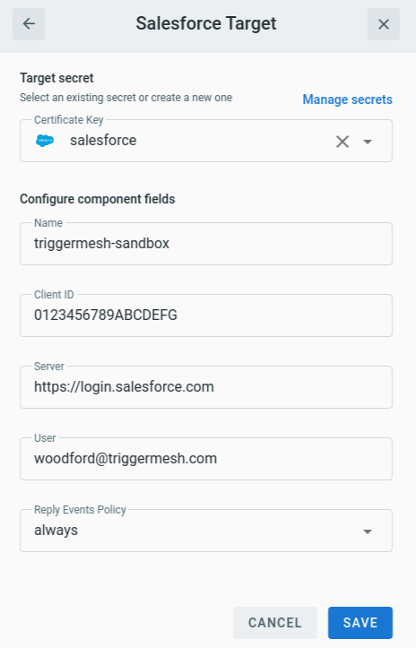

# Event Target for Salesforce

This event Target receives [CloudEvents][ce] and invokes a Salesforce endpoint.

## Prerequisites

### Salesforce Account

Salesforce target uses [OAuth JWT credentials][salesforce-oauth-jwt] for service authentication.

* First, you will need to generate an X509 certificate for signing and verifying requests. We will be using `OpenSSL` but any other certificate generation tool should work.

```sh
openssl req -x509 -sha256 -nodes -days 36500 -newkey rsa:2048 -keyout tm-sf.key -out tm-sf.crt
```

* At Salesforce site select `Setup > Apps > App Manager`, click on `New Connected App`.

    - Fill in mandatory fields, then click `Enable OAuth Settings`.
    - A callback URL is mandatory but can be filled with any HTTPS data.
    - Enable `Use digital signatures` and upload the public cert (`tm-sf.crt` in the example above).
    - Add Scopes for `api` and `refresh_token, offline_access`.
    - Save.

    

    - Select the Connected App from the list and at the click on `Manage`.
    - Click `Edit policies`.
    - Set Permitted users to `Admin approved users are pre-authorized`.
    - Save.

    

    - Select the Connected App from the list and at the click on `Manage`.
    - Click `Manage Profiles`.
    - Add permissions on the data this user will have access to.
    - Save.

* Retrieve OAuth data to configure Triggermesh Target.

    - Select the Connected App from the list and at the click on `View`.
    - Copy `Consumer Key`.
    - Reveal and copy `Consumer Secret`.

### Certificate Key Secret

The TriggerMesh Salesforce integration needs the certificate key to sign requests for the Salesforce API.
A [secret needs to be created at Triggermesh][tm-secret] that contains that certificate key.
The file name containing the key will need to be renamed to `certKey`, then select `Secrets` > `+ ADD SECRET`, `File Upload`



## Deploying an Instance of the Target

Open the Bridge creation screen and add a Target of type Salesforce.



In the Target creation form, provide a name for the event Target, and add the following information:

* **Client ID** as retrieved from Salesforce Connected App.
* **Server** for authentication at Salesforce.
* **User** for the Salesforce account.
* **Reply Events Policy** indicates when event responses should be sent back from this target.

Click the `Save` button, the console will self-navigate to the Bridge editor. Proceed by adding the remaining components to the Bridge.

After submitting the bridge, and allowing some configuration time, a green check mark on the main _Bridges_ page indicates that the bridge with was successfully created.


## Event Types

The Salesforce target expect an event type `io.triggermesh.salesforce.apicall` to perform a request against the Salesforce API, and will produced responses typed `io.triggermesh.salesforce.apicall.response`. The CloudEvent data should contain a request as defined at [this schema](../schemas/salesforce.apicall.json).

The payload contains a JSON structure with elements to execute the API request:

- `action`: is the HTTP verb to use. Required.
- `resource`: is the object family to use.
- `object`: is the object type to operate on.
- `record`: is the object instance.
- `query`: parametrized key/values for the API request.
- `payload`: body contents for the request.

All those parameters but payload are put together sequentially to build the request that will be sent to the Salesforce API:

```txt
https://<salesforce-host>/services/data/<version>/<resource>/<object>/<record>?query
```

Please, refer to the [Salesforce API][salesforce-api] on how to fill in values to execute requests.

### Reply Events Policy

When a request is sent using this target, a response might be produced containing the reply from Salesforce or an error. Depending on if there are other targets listening to these new events you might want to configure the reply behavior from this component. There are three possible values for the reply events policy:

- `Never` no response will be produced.
- `Error` only errors will be returned from the target.
- `Always` external responses or errors will be produced.

When a response is produced from a target the extended attribute `category` is added:

- `category: success` for when the request succeeds.
- `category: error` when an error occurs.

Returned errors structure is defined by [this schema](../schemas/triggermesh.error.json).

## Examples

Create a Salesforce Account object:

* event type: `io.triggermesh.salesforce.apicall`
* data:
```json
{
  "action": "POST",
  "resource": "sobjects",
  "object": "account",
  "payload": {"Name": "Jane Doe"}
}
```

Update an Account object:

* event type: `io.triggermesh.salesforce.apicall`
* data:
```json
{
  "action": "PATCH",
  "resource": "sobjects",
  "object": "account",
  "record": "0014x000005Y9SNAA0",
  "payload": {"Name": "Janet Does", "BillingCity" : "San Francisco"}
}
```

Retrieve specific fields of an Account:

* event type: `io.triggermesh.salesforce.apicall`
* data:
```json
{
  "action": "GET",
  "resource": "sobjects",
  "object": "account",
  "record": "0014x000005Y9SNAA0",
  "query": {"fields": "AccountNumber,BillingCity"}
}
```

Delete an Account object:
* event type: `io.triggermesh.salesforce.apicall`
* data:
```json
{
  "action": "DELETE",
  "resource": "sobjects",
  "object": "account",
  "record": "0014x000005Y9SNAA0"
}
```

[ce]: https://cloudevents.io/
[salesforce-api]: https://developer.salesforce.com/docs/atlas.en-us.api_rest.meta/api_rest/intro_what_is_rest_api.htm
[salesforce-oauth-jwt]: https://help.salesforce.com/articleView?id=remoteaccess_oauth_jwt_flow.htm

[tm-secret]: ../guides/secrets.md
